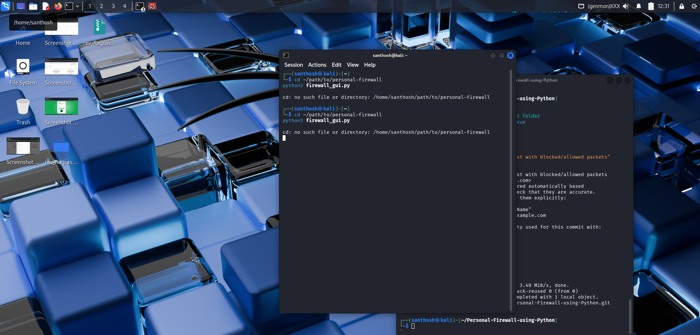
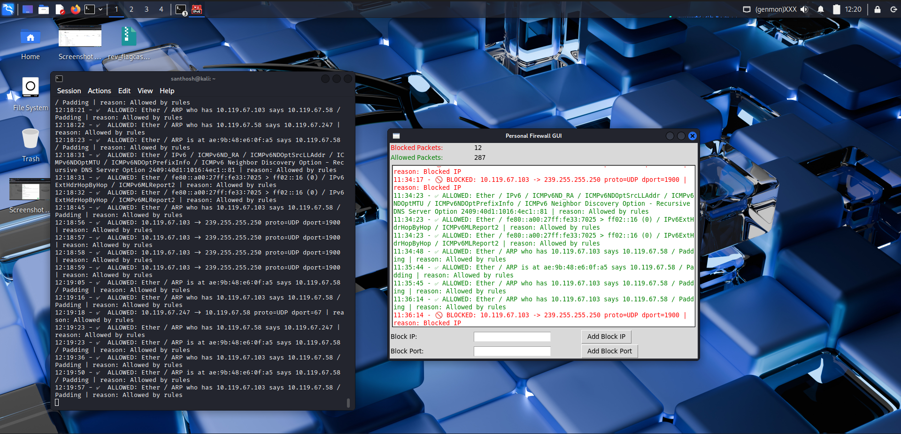
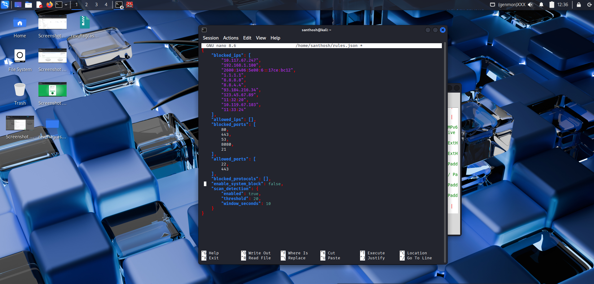
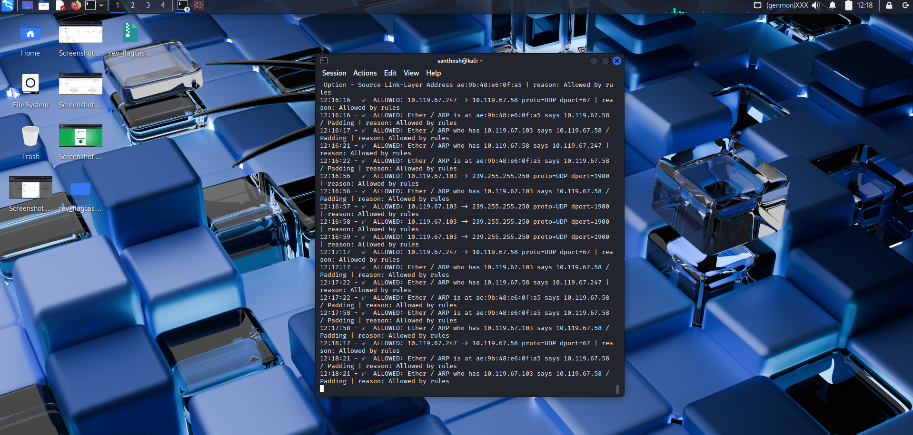
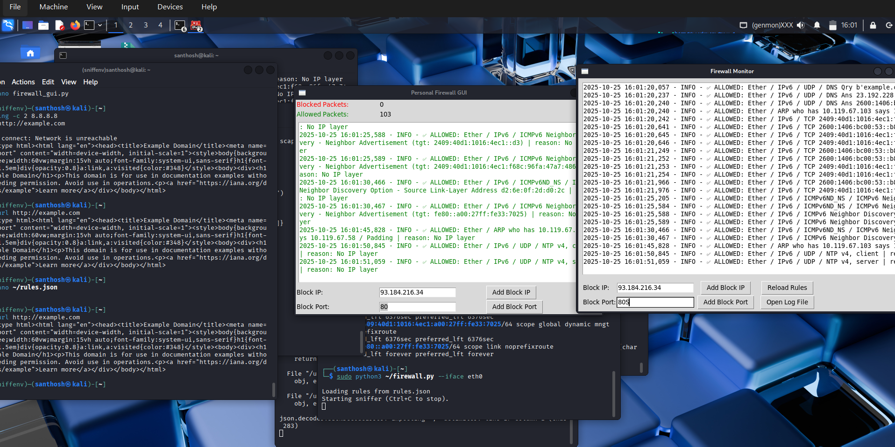

# 🔥 Personal Firewall using Python

## 📖 Project Overview

This project is a **lightweight personal firewall** built using **Python and Scapy**.
It monitors incoming and outgoing network packets, applies user-defined rules to **allow or block traffic**, and logs all activity for audit and analysis.

---

## 🎯 Objectives

* Capture real-time network traffic.
* Define customizable rule sets for blocking/allowing specific IPs or ports.
* Log all allowed and blocked packets with timestamps.
* Optional GUI for live packet monitoring.

---

## 🧰 Tools and Technologies

| Component            | Purpose                                  |
| -------------------- | ---------------------------------------- |
| **Python 3**         | Main programming language                |
| **Scapy**            | Packet sniffing and analysis             |
| **Tkinter**          | Optional GUI interface                   |
| **iptables (Linux)** | System-level rule enforcement (optional) |

---

## ⚙️ Features

✅ Live packet sniffing
✅ Rule-based filtering (IPs, ports, protocols)
✅ Real-time console logging
✅ Log file generation (`firewall_log.txt`)
✅ Expandable GUI (Tkinter-based)

---

## 🧩 Project Structure

```
Personal-Firewall-using-Python/
│
├── firewall.py           # Core packet sniffing and rule handling logic
├── firewall_gui.py       # Optional GUI for monitoring
├── rules.json            # Custom rules file (blocked IPs/ports)
├── firewall_log.txt      # Log file for allowed/blocked packets
└── README.md             # Project documentation
```

---

## 🚀 How to Run

### 1️⃣ Install Dependencies

Install the required libraries before running the project:

```bash
sudo apt update
sudo apt install -y python3 python3-pip python3-tk
python3 -m pip install --user scapy
```

### 2️⃣ Run the Firewall

Use this command to start monitoring your network:

```bash
sudo python3 firewall.py --iface eth0
```

*(Replace `eth0` with your actual network interface name.)*

### 3️⃣ Modify Rules

Customize your firewall rules in `rules.json`:

```json
{
  "blocked_ips": ["192.168.1.5", "10.10.10.10"],
  "blocked_ports": [80, 443]
}
```

Save and rerun the script — blocked packets will appear as 🚫 in logs.

---

## 📋 Sample Log Output

Example from `firewall_log.txt`:

```
2025-10-25 15:51:17,464 - INFO - 🚫 BLOCKED: 10.119.67.247 -> 23.220.75.232 proto=TCP dport=80 | reason: Blocked Port
2025-10-25 15:51:18,467 - INFO - ✅ ALLOWED: 10.119.67.103 -> 239.255.255.250 proto=UDP dport=1900 | reason: Allowed by rules
2025-10-25 15:51:19,401 - INFO - ✅ ALLOWED: Ether / IPv6 / ICMPv6ND_NS / ICMPv6 Neighbor Discovery Option | reason: No IP layer
2025-10-25 15:51:20,643 - INFO - ✅ ALLOWED: 0.0.0.0 -> 255.255.255.255 proto=UDP dport=67 | reason: Allowed by rules
2025-10-25 15:52:25,119 - INFO - ✅ ALLOWED: 0.0.0.0 -> 255.255.255.255 proto=UDP dport=67 | reason: Allowed by rules
```

---

## 📸 Screenshots (with filenames and purposes)

### 🔹 Firewall Running


**Description:** Terminal showing the firewall actively sniffing packets and displaying allowed connections.

```bash
# Example output
✅ ALLOWED: 10.119.67.103 -> 239.255.255.250 proto=UDP dport=1900 | reason: Allowed by rules
```

### 🔹 Blocked Packet Example


**Description:** Shows a blocked packet entry in the terminal/log (e.g., port 80 or a blocked IP).

```bash
# Example output
🚫 BLOCKED: 10.119.67.247 -> 23.220.75.232 proto=TCP dport=80 | reason: Blocked Port
```

### 🔹 Rules Configuration


**Description:** `rules.json` file open in your text editor showing blocked IPs and ports.

```json
{
  "blocked_ips": ["192.168.1.5", "10.10.10.10"],
  "blocked_ports": [80, 443]
}
```

### 🔹 Log File


**Description:** Contents of `firewall_log.txt` showing both blocked and allowed packets.

```
2025-10-25 15:51:17,464 - INFO - 🚫 BLOCKED: ...
2025-10-25 15:51:18,467 - INFO - ✅ ALLOWED: ...
```

### 🔹 GUI Mode (Optional)


**Description:** Tkinter GUI window showing live packet monitoring (if GUI version is used).
### 🖥️ GUI Comparison: Updated (Left) vs Old (Right)

In the image below, the **left window** shows the **updated GUI** and the **right window** displays the **old GUI** version of the firewall monitor.

The **updated GUI** introduces new features such as:
- **Blocked Packets** and **Allowed Packets** counters for real-time monitoring
- Cleaner and more organized layout
- Input fields for blocking specific IP addresses and ports
- Better visibility of firewall activity and status

The **old GUI** on the right side only displayed continuous packet logs without showing any blocked or allowed packet statistics.  
With the update, users can now easily track how many packets are being blocked or allowed and perform quick IP/port blocking directly from the interface.

**Screenshot Reference:**  
*Left – Updated GUI showing packet counters and control fields.*  
*Right – Old GUI showing only live logs.*


---

## 🧠 Learning Outcomes

* Gained hands-on experience with network packet analysis.
* Understood firewall rule mechanisms and traffic filtering.
* Applied Python scripting for cybersecurity use cases.
* Learned logging and auditing of network activities.

---

## 🏁 Conclusion

This project successfully demonstrates how Python can be used to build a basic yet functional personal firewall.
With further improvements, it can evolve into a full-fledged intrusion detection and prevention system (IDS/IPS).

---

## 👨‍💻 Author

**Santhosh**
Cybersecurity Intern

Repository: **Personal-Firewall-using-Python**

---
